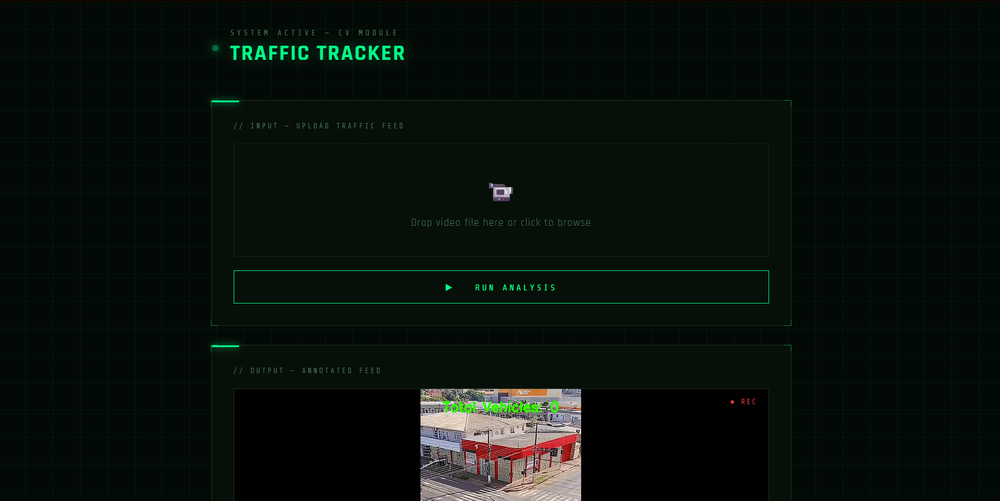

\# 🚦 Traffic Tracker


Real-time vehicle detection and tracking system built with YOLOv8 + ByteTrack.


\## What it does

\- Detects vehicles (cars, trucks, buses, motorcycles) in traffic footage

\- Assigns a unique ID to every vehicle and tracks it across frames

\- Draws bounding boxes, ID labels and motion trails on the video

\- Generates an analytics report with vehicle type breakdown and time-in-frame per vehicle

\- Displays everything through a web interface


\## Tech Stack

| Tool | Purpose |

|------|---------|

| YOLOv8 | Object detection |

| ByteTrack | Multi-object tracking |

| OpenCV | Video I/O and annotation |

| Flask | Web server |

| ffmpeg | Video re-encoding for browser |

| Supervision | ByteTrack wrapper + annotators |


\## How to Run

1\. Install dependencies

&#x20;  pip install ultralytics supervision flask opencv-python

2\. Run the app

&#x20;  python app.py

3\. Open browser at http://127.0.0.1:5000

4\. Upload a traffic video and wait for results


\## Output

\- Annotated video with bounding boxes, IDs and motion trails

\- Text report with unique vehicle count, type breakdown, max simultaneous vehicles and time-in-frame per ID


\## Known Limitations

\- ID switches can occur when vehicles cross each other — this is normal ByteTrack behaviour

\- Brief false detections at frame edges may inflate the unique object count



```

